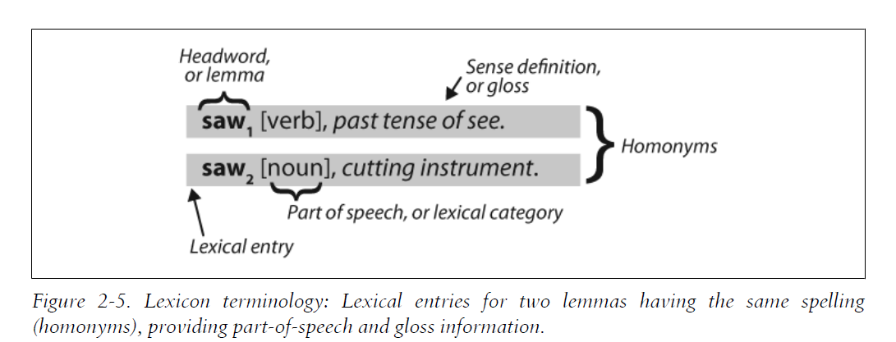

linguistic data (corpora)

# Accessing Text Corpora
首先载入一个corpora（从默认库或者网上），接着使用.fileids(), 来看the file identifiers in this corpus。这个方法会返回给你该corpora里面的文件名。使用.words()方法可以按照words处理内容，.setns()按照句子，.raw()则会按照每一个letter处理。其差异可以直观的理解如下：
```
>>> raw = gutenberg.raw("burgess-busterbrown.txt")
>>> raw[1:20]
'The Adventures of B'
>>> words = gutenberg.words("burgess-busterbrown.txt")
>>> words[1:20]
['The', 'Adventures', 'of', 'Buster', 'Bear', 'by', 'Thornton', 'W', '.',
'Burgess', '1920', ']', 'I', 'BUSTER', 'BEAR', 'GOES', 'FISHING', 'Buster',
'Bear']
>>> sents = gutenberg.sents("burgess-busterbrown.txt")
>>> sents[1:20]
[['I'], ['BUSTER', 'BEAR', 'GOES', 'FISHING'], ['Buster', 'Bear', 'yawned', 'as',
'he', 'lay', 'on', 'his', 'comfortable', 'bed', 'of', 'leaves', 'and', 'watched',
'the', 'first', 'early', 'morning', 'sunbeams', 'creeping', 'through', ...], ...]
```

可以载入自己的库（注意下列使用r避免转义）：
```python
from nltk.corpus import BracketParseCorpusReader
corpus_root = r"C:\corpora\penntreebank\parsed\mrg\wsj"
file_pattern = r".*/wsj_.*\.mrg"
ptb = BracketParseCorpusReader(corpus_root, file_pattern)
ptb.fileids()
# ['00/wsj_0001.mrg', '00/wsj_0002.mrg', '00/wsj_0003.mrg', '00/wsj_0004.mrg', ...]
len(ptb.sents())
# 49208
```

# Conditional Frequency Distributions
A conditional frequency distribution is a collection of frequency distributions, each one for a different
"condition." The condition will often be the category of the text.

简单来说，之前我们的都是FreqDist()，这次我们需要组成一个pair:(condition,event)，而这个condition通常是genre。.ConditionalFreqDist()方法中，需要放入pair，这个pair可以提前用循环生成，也可以直接当场用生成式写
```python
from nltk.corpus import inaugural
cfd = nltk.ConditionalFreqDist(
    (target, fileid[:4])
    for fileid in inaugural.fileids()
    for w in inaugural.words(fileid)
    for target in ['america', 'citizen']
    if w.lower().startswith(target))
cfd.plot()
```
用.ConditionalFreqDist()方法构筑一个CFD对象之后，可以直接使用plot将其画出来。如果想要统计cumulative frequency data则需要使用.tabulate()，并且如果只想展示部分的，可以设置conditions=['English', 'German_Deutsch']之类的参数。condition参数会限定pairs里面condition为XX的才会弄出来。plot和tabulate共用samples,condtions两个参数。

下面举一个具体一点的例子。比如，我们需要brown corpus里面的news&romance作为genre，并统计每周不同日的情况，那就需要使用samples=参数，设置samples为monday.......sunday

```python
days = ['Monday','Tuesday','Wednesday',"Thuesday",'Friday','Saterday','Sunday']
cfd = nltk.ConditionalFreqDist(
    (genre,words)
    for genre in ['news', 'romance']
    for words in brown.words(categories=genre)
    )
cfd.tabulate(samples=days)
cfd.plot(samples=days)
```

word pairs，也就是bigram，可以用内置的bigram()函数来生成：
```
>>> sent = ['In', 'the', 'beginning', 'God', 'created', 'the', 'heaven',
... 'and', 'the', 'earth', '.']
>>> nltk.bigrams(sent)
[('In', 'the'), ('the', 'beginning'), ('beginning', 'God'), ('God', 'created'),
('created', 'the'), ('the', 'heaven'), ('heaven', 'and'), ('and', 'the'),
('the', 'earth'), ('earth', '.')]
```

# Lexical Resources
A lexicon, or lexical resource, is a collection of words and/or phrases along with associated information, such as part-of-speech and sense definitions.比如FreqDist()生成的和sorted(set())生成的都可以算是lexicon，因为他们包含了信息，都是secondary to texts

lexicon的结构如下图所示：



NLTK自带许多的wordlist形式的corpora：
```python
nltk.corpus.words.words()
# 常见英语词
from nltk.corpus import stopwords
stopwords.words('english')
# 英语里的stopwords
```

85

