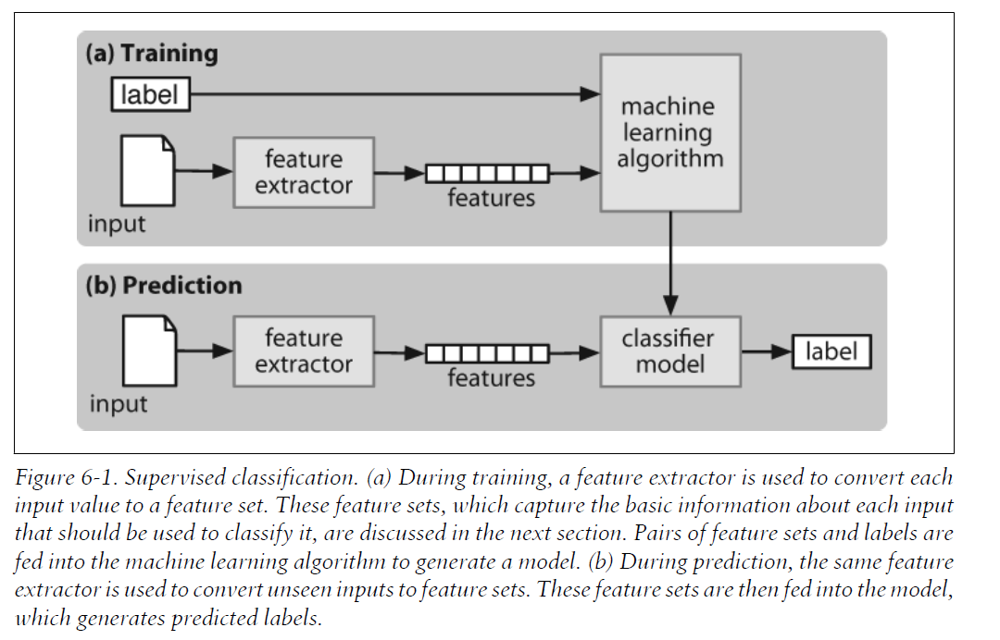

The goal of this chapter is to answer the following questions:

1. How can we identify particular features of language data that are salient for classifying it?

2. How can we construct models of language that can be used to perform language processing tasks automatically?

3. What can we learn about language from these models?

# Supervised Classification

A classifier is called supervised if it is built based on training corpora containing the correct label for each input. The framework used by supervised classification is shown below



使用nltk的naiveBayes的代码如下：
```python
import nltk
def gender_features(word):
    return {'last_letter': word[-1]}
def gender_featuresl(word):
    return {'length': len(word)}
from nltk.corpus import names
import random
names = ([(name, 'male') for name in names.words('male.txt')] +
    [(name, 'female') for name in names.words('female.txt')])
random.shuffle(names)

featuresets = [(gender_featuresl(n), g) for (n,g) in names]
train_set, test_set = featuresets[500:], featuresets[:500]
classifier = nltk.NaiveBayesClassifier.train(train_set)
print(nltk.classify.accuracy(classifier, test_set))
```
注意NaiveBayes的输入必须要是（字典形式的features，label）。当Corpos很大的时候，自己定义函数搞features会占用大量内存，这个时候就可以使用nltk.classify.apply_features()函数
```python
from nltk.classify import apply_features
train_set = apply_features(gender_features, names[500:])
test_set = apply_features(gender_features, names[:500])
```

为了解决feature太多的overfitting问题，a very productive method for refining the feature set is error analysis. First, we select a development set, containing the corpus data for creating the model. This development set is then subdivided into the training set and the dev-test set.简单来说就是train test split，把train分成train和dev-test，用dev-test作error analysis，也就是找出classifier会错误判断的，接着分析原因，然后改进feature extractor。

接着介绍了对document、对part of speech还有sequence的一般方法。sequence的方法consecutive classification or greedy sequence classification, is to find the most likely class label for the first input, then to use that answer to help find the best label for the next input.但是缺点就是发现了错误你也没办法回过头去改正。

一个解决办法是用transformational strategy代替，它会回溯修改（比如Brill tagger）；另一个就是对所有可能的结果打分然后选择总分最高的，也就是This is the approach taken by Hidden Markov Models. 它不是只生成最好的，而是生成概率分布，然后计算总的来说最高的（也就是有多个分支都先保留，然后最后选择的时候选总分最高的）。这个坏处就是因为分支太多就很庞大。

# Further Examples of Supervised Classification
256