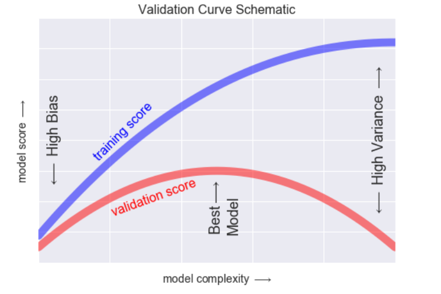
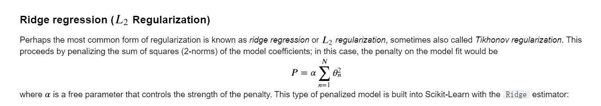
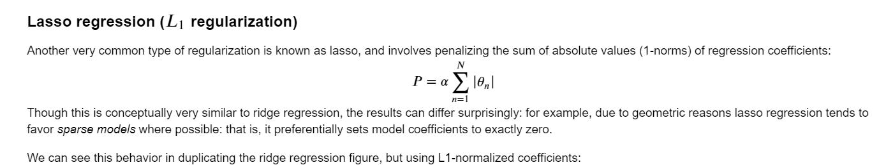

# Categories of Machine Learning
## Classification: Predicting discrete labels
先用数据集训练，使得能够把一个数据集里的数据分为两类。这样就可以得到一个分界线的方程，用于后续数据集的分类。

## Regression: Predicting continuous labels


## Clustering: Inferring labels on unlabeled data
没有label，但是数据有集群的现象（automatically assigned to some number of discrete groups）。k-means fits a model consisting of k cluster centers，模型通过点到各个cluster centers之间的距离来判断这个点该归属于哪个cluster

## Dimensionality reduction: Inferring structure of unlabeled data
降低维度，比如这个二维的螺旋可以降低为一维的数轴，通过这个办法得到了一个一维轴。

# Introducing Scikit-Learn
## Data Representation
### Table
一个二维的表格。rows称为samples，number of rows为n_samples；同理，columns称为features，number of columns为n_features。

因为这种table是二维的，所以可以把它当作matrix，故称之为features matrix（X），视作多个feature组成的matrix。而每一列，视为target array（y），一个一维Numpy array（或Pandas Series）
### Estimator API
步骤如下：

1.Choose a class of model by importing the appropriate estimator class from Scikit-Learn.载入合适的estimator。

2.Choose model hyperparameters by instantiating this class with desired values.通过用所需的值实例化此类来选择模型超参数

3.Arrange data into a features matrix and target vector following the discussion above.

4.Fit the model to your data by calling the fit() method of the model instance.

5.Apply the Model to new data:For supervised learning, often we predict labels for unknown data using the predict() method；For unsupervised learning, we often transform or infer properties of the data using the transform() or predict() method.

接下来进入例子讲解

```python
import matplotlib.pyplot as plt
import numpy as np

rng = np.random.RandomState(42)
x = 10 * rng.rand(50)
y = 2 * x - 1 + rng.randn(50)
plt.scatter(x, y)
#选择class of model，线性回归就选线性
from sklearn.linear_model import LinearRegression
#选择hyperparameter，考虑下列问题：
#Would we like to fit for the offset (i.e., y-intercept)? 需要截距嘛
#Would we like the model to be normalized?需要正态化嘛
#Would we like to preprocess our features to add model flexibility?
#What degree of regularization would we like to use in our model?
#How many model components would we like to use?
model = LinearRegression(fit_intercept=True)
#得到LinearRegression(copy_X=True, fit_intercept=True, n_jobs=1, normalize=False)
#Arrange data into a features matrix and target vector，y是n_samples长度的array了，但是x不是matrix，所以要改
X = x[:, np.newaxis]
#fit
model.fit(X, y)
model.coef_
model.intercept_
#predict，注意预测的输入数据也要是matrix
xfit = np.linspace(-1, 11)
Xfit = xfit[:, np.newaxis]
yfit = model.predict(Xfit)
plt.scatter(x, y)
plt.plot(xfit, yfit)
```
也就是说，选择好import什么model之后，选择hyperparameter（见下一章），再把数据处理成X-matrix，y-array，然后就扔进去fit，fit完了可以predict。一般来说用下列函数spilit并测试结果
```python
from sklearn.cross_validation import train_test_split
Xtrain, Xtest, ytrain, ytest = train_test_split(X, y, random_state=0)
from sklearn.naive_bayes import GaussianNB
model = GaussianNB()
model.fit(Xtrain, ytrain)
y_model = model.predict(Xtest)
from sklearn.metrics import accuracy_score
accuracy_score(ytest, y_model)
```
想看结果偏差在哪，可以用confusion_matrix，非对角线上的格子就表示预测出错的
```python
from sklearn.metrics import confusion_matrix

mat = confusion_matrix(ytest, y_model)

sns.heatmap(mat, square=True, annot=True, cbar=False)
plt.xlabel('predicted value')
plt.ylabel('true value');
```

# Hyperparameters and Model Validation
## Model Validation
model validation: after choosing a model and its hyperparameters, we can estimate how effective it is by applying it to some of the training data and comparing the prediction to the known value.

### holdout set
holdout set: hold back some subset of the data from the training of the model, and then use this holdout set to check the model performance. 可以使用train_test_split（Scikit-Learn）来进行数据分割:
```python
from sklearn.cross_validation import train_test_split
# split the data with 50% in each set
X1, X2, y1, y2 = train_test_split(X, y, random_state=0,
                                  train_size=0.5)

# fit the model on one set of data
model.fit(X1, y1)

# evaluate the model on the second set of data
y2_model = model.predict(X2)
accuracy_score(y2, y2_model)
```
### cross-validation
但是holdout set有一个不好的地方就在于它只用了一部分数据来训练，可能会导致训练集太小等问题。所以用cross-validation:to do a sequence of fits where each subset of the data is used both as a training set and as a validation set.
```python
from sklearn.cross_validation import train_test_split
# split the data with 50% in each set
X1, X2, y1, y2 = train_test_split(X, y, random_state=0,
                                  train_size=0.5)
y2_model = model.fit(X1, y1).predict(X2)
y1_model = model.fit(X2, y2).predict(X1)
accuracy_score(y1, y1_model), accuracy_score(y2, y2_model)
```
更简化的方法是用SKLEAN的cross_val_score：
```python
from sklearn.cross_validation import cross_val_score
cross_val_score(model, X, y, cv=5)
```
这是课上讲过的cross validation，还有种极端方法就是每次只抽一个的leave-one-out cross validation：
```python
from sklearn.cross_validation import LeaveOneOut
scores = cross_val_score(model, X, y, cv=LeaveOneOut(len(X)))
print(scores)
scores.mean()
```
## 选择最优模型
### The Bias-variance trade-off
如果模型太简单，那么bias就会很高（比如一大堆点，你一条直线），预测偏差大；但是如果模型很复杂，variance就会很高（比如你用无穷级数拟合一条曲线完美过每个点），太贴近训练集就没有预测的意义，偏差更大。

underfit the data: that is, it does not have enough model flexibility to suitably account for all the features in the data; another way of saying this is that the model has high bias（attempts to find a straight-line fit through the data. Because the data are intrinsically more complicated than a straight line, the straight-line model will never be able to describe this dataset well）

overfit the data: that is, it has so much model flexibility that the model ends up accounting for random errors as well as the underlying data distribution; another way of saying this is that the model has high variance.（attempts to fit a high-order polynomial through the data. Here the model fit has enough flexibility to nearly perfectly account for the fine features in the data, but even though it very accurately describes the training data, its precise form seems to be more reflective of the particular noise properties of the data rather than the intrinsic properties of whatever process generated that data.）

R^2，coefficient of determination, which measures how well a model performs relative to a simple mean of the target values.high-bias的模型，validation set的表现和训练集差不多；high-variance的模型，validation set的表现会差得多。



从validation curve可以得知：

1）training score总是高于validation score的，因为模型总是比起没见过的和见过的更fit

2）low model complexity(high-bias)时，under-fit，对training data和没见过的预测都很差

3）high model complexity(high-variance)时，over-fit，模型预测training data好，没见过的差

4）在中间的时候validation curve达到最大值，此时This level of complexity indicates a suitable trade-off between bias and variance.

### validation curve
用pipeline把a simple linear regression 和the polynomial preprocessor结合起来
```python
from sklearn.preprocessing import PolynomialFeatures
from sklearn.linear_model import LinearRegression
from sklearn.pipeline import make_pipeline

def PolynomialRegression(degree=2, **kwargs):
    return make_pipeline(PolynomialFeatures(degree),
                         LinearRegression(**kwargs))
import numpy as np

def make_data(N, err=1.0, rseed=1):
    # randomly sample the data
    rng = np.random.RandomState(rseed)
    X = rng.rand(N, 1) ** 2
    y = 10 - 1. / (X.ravel() + 0.1)
    if err > 0:
        y += err * rng.randn(N)
    return X, y

X, y = make_data(40)
import matplotlib.pyplot as plt
import seaborn; seaborn.set()  # plot formatting

X_test = np.linspace(-0.1, 1.1, 500)[:, None]

plt.scatter(X.ravel(), y, color='black')
axis = plt.axis()
for degree in [1, 3, 5]:
    y_test = PolynomialRegression(degree).fit(X, y).predict(X_test)
    plt.plot(X_test.ravel(), y_test, label='degree={0}'.format(degree))
plt.xlim(-0.1, 1.0)
plt.ylim(-2, 12)
plt.legend(loc='best')
```
上述代码并不能确定degree of the polynomial，因为就做了三条，要确定degree of ploynomial以得到合适的trade-off between bias (under-fitting) and variance (over-fitting)，可以用包自带的validation_curve。
```python
from sklearn.learning_curve import validation_curve
degree = np.arange(0, 21)
train_score, val_score = validation_curve(PolynomialRegression(), X, y,
                                          'polynomialfeatures__degree', degree, cv=7)

plt.plot(degree, np.median(train_score, 1), color='blue', label='training score')
plt.plot(degree, np.median(val_score, 1), color='red', label='validation score')
plt.legend(loc='best')
plt.ylim(0, 1)
plt.xlabel('degree')
plt.ylabel('score')
# 从图上看出3是最好的
plt.scatter(X.ravel(), y)
lim = plt.axis()
y_test = PolynomialRegression(3).fit(X, y).predict(X_test)
plt.plot(X_test.ravel(), y_test);
plt.axis(lim)
```
## Learning Curves
```python
X2, y2 = make_data(200)
plt.scatter(X2.ravel(), y2)
degree = np.arange(21)
train_score2, val_score2 = validation_curve(PolynomialRegression(), X2, y2,
                                            'polynomialfeatures__degree', degree, cv=7)

plt.plot(degree, np.median(train_score2, 1), color='blue', label='training score')
plt.plot(degree, np.median(val_score2, 1), color='red', label='validation score')
plt.plot(degree, np.median(train_score, 1), color='blue', alpha=0.3, linestyle='dashed')
plt.plot(degree, np.median(val_score, 1), color='red', alpha=0.3, linestyle='dashed')
plt.legend(loc='lower center')
plt.ylim(0, 1)
plt.xlabel('degree')
plt.ylabel('score')
```
从图可以得到结果：对给定的复杂度，小样本会overfit（training socre高了，validation score低了）；大样本会underfit（training score低了，validation score高了）；一般而言training总是比validation要高的，也就是说两个curve不应该会交叉。

当然，Sklearn提供了便利的方式来做learning_curve
```python
from sklearn.learning_curve import learning_curve

fig, ax = plt.subplots(1, 2, figsize=(16, 6))
fig.subplots_adjust(left=0.0625, right=0.95, wspace=0.1)

for i, degree in enumerate([2, 9]):
    N, train_lc, val_lc = learning_curve(PolynomialRegression(degree),
                                         X, y, cv=7,
                                         train_sizes=np.linspace(0.3, 1, 25))

    ax[i].plot(N, np.mean(train_lc, 1), color='blue', label='training score')
    ax[i].plot(N, np.mean(val_lc, 1), color='red', label='validation score')
    ax[i].hlines(np.mean([train_lc[-1], val_lc[-1]]), N[0], N[-1],
                 color='gray', linestyle='dashed')

    ax[i].set_ylim(0, 1)
    ax[i].set_xlim(N[0], N[-1])
    ax[i].set_xlabel('training size')
    ax[i].set_ylabel('score')
    ax[i].set_title('degree = {0}'.format(degree), size=14)
    ax[i].legend(loc='best')
```
# Feature Engineering
## Categorical Features
要用one-hot encoding的话，用DictVectorizer即可
```python
data = [
    {'price': 850000, 'rooms': 4, 'neighborhood': 'Queen Anne'},
    {'price': 700000, 'rooms': 3, 'neighborhood': 'Fremont'},
    {'price': 650000, 'rooms': 3, 'neighborhood': 'Wallingford'},
    {'price': 600000, 'rooms': 2, 'neighborhood': 'Fremont'}
]
from sklearn.feature_extraction import DictVectorizer
vec = DictVectorizer(sparse=False, dtype=int)
vec.fit_transform(data)
```
自动把三个neighborhood参数转换成了三个01变量，即'neighborhood=Fremont', 'neighborhood=Queen Anne', 'neighborhood=Wallingford'
## Text Features
可以用CountVectorizer来把文本的每一个都拆成01变量，来统计
```python
sample = ['problem of evil',
          'evil queen',
          'horizon problem']
from sklearn.feature_extraction.text import CountVectorizer

vec = CountVectorizer()
X = vec.fit_transform(sample)
import pandas as pd
pd.DataFrame(X.toarray(), columns=vec.get_feature_names())
```
对文本来说，如果用上述的拆分，会出现一点问题那就是只会按照有没有拆，不够直观。对于文本，我们总是更想统计它出现的频率，因此可以使用term frequency-inverse document frequency（TF-IDF）来做weights
```python
sample = ['problem of evil',
          'evil queen',
          'horizon problem']
from sklearn.feature_extraction.text import TfidfVectorizer
vec = TfidfVectorizer()
X = vec.fit_transform(sample)
pd.DataFrame(X.toarray(), columns=vec.get_feature_names())
```
## Derived Features
一个非常简单的方法，当x不好描述的时候，用polynomialfeatures把高次项加进去来预测
```python
import numpy as np
import matplotlib.pyplot as plt

x = np.array([1, 2, 3, 4, 5])
y = np.array([4, 2, 1, 3, 7])
plt.scatter(x, y)
from sklearn.linear_model import LinearRegression
X = x[:, np.newaxis]
model = LinearRegression().fit(X, y)
yfit = model.predict(X)
plt.scatter(x, y)
plt.plot(x, yfit)
from sklearn.preprocessing import PolynomialFeatures
poly = PolynomialFeatures(degree=3, include_bias=False)
X2 = poly.fit_transform(X)
print(X2)
model = LinearRegression().fit(X2, y)
yfit = model.predict(X2)
plt.scatter(x, y)
plt.plot(x, yfit)
```
## Imputation of Missing Data
When applying a typical machine learning model to such data, we will need to first replace such missing data with some appropriate fill value. This is known as imputation of missing values, and strategies range from simple (e.g., replacing missing values with the mean of the column) to sophisticated (e.g., using matrix completion or a robust model to handle such data).

最基础的imputation方法是用mean,median或者众数来填充NaN,Sklearn有专门的Imputer class可以用
```python
from numpy import nan
X = np.array([[ nan, 0,   3  ],
              [ 3,   7,   9  ],
              [ 3,   5,   2  ],
              [ 4,   nan, 6  ],
              [ 8,   8,   1  ]])
y = np.array([14, 16, -1,  8, -5])
from sklearn.preprocessing import Imputer
imp = Imputer(strategy='mean')
X2 = imp.fit_transform(X)
print(X2)
model = LinearRegression().fit(X2, y)
model.predict(X2)
```
## Feature Pipelines
当上述步骤你都要搞一遍的时候，比如先Impute missing values using the mean再Transform features to quadratic最后Fit a linear regression，都做一遍太傻了，可以用Sklearn的Pipeline object来合并一起搞
```python
from sklearn.pipeline import make_pipeline

model = make_pipeline(Imputer(strategy='mean'),
                      PolynomialFeatures(degree=2),
                      LinearRegression())
model.fit(X, y)  # X with missing values, from above
print(y)
print(model.predict(X))
```

# Naive Bayes
## Gaussian Naive Bayes
```python
import numpy as np
import matplotlib.pyplot as plt
import seaborn as sns; sns.set()
from sklearn.datasets import make_blobs
X, y = make_blobs(100, 2, centers=2, random_state=2, cluster_std=1.5)
plt.scatter(X[:, 0], X[:, 1], c=y, s=50, cmap='RdBu')
from sklearn.naive_bayes import GaussianNB
model = GaussianNB()
model.fit(X, y)
rng = np.random.RandomState(0)
Xnew = [-6, -14] + [14, 18] * rng.rand(2000, 2)
ynew = model.predict(Xnew)
plt.scatter(X[:, 0], X[:, 1], c=y, s=50, cmap='RdBu')
lim = plt.axis()
plt.scatter(Xnew[:, 0], Xnew[:, 1], c=ynew, s=20, cmap='RdBu', alpha=0.1)
plt.axis(lim)
```
模型出来之后，可以直接得到预测的概率
```python
yprob = model.predict_proba(Xnew)
yprob[-8:].round(2)
```
第一列是第一个label的概率，第二列为第二个

## Multinomial Naive Bayes
One place where multinomial naive Bayes is often used is in text classification，也就是TF-IDF方法，举例如下
```python
from sklearn.datasets import fetch_20newsgroups

data = fetch_20newsgroups()
print(data.target_names)
categories = ['talk.religion.misc', 'soc.religion.christian',
              'sci.space', 'comp.graphics']
train = fetch_20newsgroups(subset='train', categories=categories)
test = fetch_20newsgroups(subset='test', categories=categories)
from sklearn.feature_extraction.text import TfidfVectorizer
from sklearn.naive_bayes import MultinomialNB
from sklearn.pipeline import make_pipeline

model = make_pipeline(TfidfVectorizer(), MultinomialNB())
model.fit(train.data, train.target)
labels = model.predict(test.data)
from sklearn.metrics import confusion_matrix
mat = confusion_matrix(test.target, labels)
sns.heatmap(mat.T, square=True, annot=True, fmt='d', cbar=False,
            xticklabels=train.target_names, yticklabels=train.target_names)
plt.xlabel('true label')
plt.ylabel('predicted label')
```
如果要预测的话可以用pipeline黏起来
```python
def predict_category(s, train=train, model=model):
    pred = model.predict([s])
    return train.target_names[pred[0]]
```

# Linear Regression
## Simple Linear Regression
用LinearRegression即可
```python
import matplotlib.pyplot as plt
import seaborn as sns; sns.set()
import numpy as np
rng = np.random.RandomState(1)
x = 10 * rng.rand(50)
y = 2 * x - 5 + rng.randn(50)
plt.scatter(x, y)
from sklearn.linear_model import LinearRegression
model = LinearRegression(fit_intercept=True)

model.fit(x[:, np.newaxis], y)

xfit = np.linspace(0, 10, 1000)
yfit = model.predict(xfit[:, np.newaxis])

plt.scatter(x, y)
plt.plot(xfit, yfit)
print("Model slope:    ", model.coef_[0])
print("Model intercept:", model.intercept_)
rng = np.random.RandomState(1)
X = 10 * rng.rand(100, 3)
y = 0.5 + np.dot(X, [1.5, -2., 1.])

model.fit(X, y)
print(model.intercept_)
print(model.coef_)
```
## Polynomial basis functions
用PolynomialFeatures
```python
from sklearn.preprocessing import PolynomialFeatures
x = np.array([2, 3, 4])
poly = PolynomialFeatures(3, include_bias=False)
poly.fit_transform(x[:, None])
from sklearn.pipeline import make_pipeline
poly_model = make_pipeline(PolynomialFeatures(7),
                           LinearRegression())
rng = np.random.RandomState(1)
x = 10 * rng.rand(50)
y = np.sin(x) + 0.1 * rng.randn(50)

poly_model.fit(x[:, np.newaxis], y)
yfit = poly_model.predict(xfit[:, np.newaxis])

plt.scatter(x, y)
plt.plot(xfit, yfit)
```
## Gaussian basis functions
```python
from sklearn.base import BaseEstimator, TransformerMixin

class GaussianFeatures(BaseEstimator, TransformerMixin):
    """Uniformly spaced Gaussian features for one-dimensional input"""
    
    def __init__(self, N, width_factor=2.0):
        self.N = N
        self.width_factor = width_factor
    
    @staticmethod
    def _gauss_basis(x, y, width, axis=None):
        arg = (x - y) / width
        return np.exp(-0.5 * np.sum(arg ** 2, axis))
        
    def fit(self, X, y=None):
        # create N centers spread along the data range
        self.centers_ = np.linspace(X.min(), X.max(), self.N)
        self.width_ = self.width_factor * (self.centers_[1] - self.centers_[0])
        return self
        
    def transform(self, X):
        return self._gauss_basis(X[:, :, np.newaxis], self.centers_,
                                 self.width_, axis=1)
    
gauss_model = make_pipeline(GaussianFeatures(20),
                            LinearRegression())
gauss_model.fit(x[:, np.newaxis], y)
yfit = gauss_model.predict(xfit[:, np.newaxis])

plt.scatter(x, y)
plt.plot(xfit, yfit)
plt.xlim(0, 10)
```
## Regularization
```python
model = make_pipeline(GaussianFeatures(30),
                      LinearRegression())
model.fit(x[:, np.newaxis], y)

plt.scatter(x, y)
plt.plot(xfit, model.predict(xfit[:, np.newaxis]))

plt.xlim(0, 10)
plt.ylim(-1.5, 1.5)
def basis_plot(model, title=None):
    fig, ax = plt.subplots(2, sharex=True)
    model.fit(x[:, np.newaxis], y)
    ax[0].scatter(x, y)
    ax[0].plot(xfit, model.predict(xfit[:, np.newaxis]))
    ax[0].set(xlabel='x', ylabel='y', ylim=(-1.5, 1.5))
    
    if title:
        ax[0].set_title(title)

    ax[1].plot(model.steps[0][1].centers_,
               model.steps[1][1].coef_)
    ax[1].set(xlabel='basis location',
              ylabel='coefficient',
              xlim=(0, 10))
    
model = make_pipeline(GaussianFeatures(30), LinearRegression())
basis_plot(model)
```
## Ridge regression ( L2  Regularization)


使用Ridge estimator即可
```python
from sklearn.linear_model import Ridge
model = make_pipeline(GaussianFeatures(30), Ridge(alpha=0.1))
basis_plot(model, title='Ridge Regression')
```
### Lasso regression ( L1  regularization)

```python
from sklearn.linear_model import Lasso
model = make_pipeline(GaussianFeatures(30), Lasso(alpha=0.001))
basis_plot(model, title='Lasso Regression')
```
## Random Forests
### Motivating Random Forests: Decision Trees
先创建decision tree，使用Sklearn的DecisionTreeClassifier estimator
```python
import numpy as np
import matplotlib.pyplot as plt
import seaborn as sns; sns.set()
from sklearn.datasets import make_blobs

X, y = make_blobs(n_samples=300, centers=4,
                  random_state=0, cluster_std=1.0)
plt.scatter(X[:, 0], X[:, 1], c=y, s=50, cmap='rainbow')
from sklearn.tree import DecisionTreeClassifier
tree = DecisionTreeClassifier().fit(X, y)
# 创建一个用来画图的函数
def visualize_classifier(model, X, y, ax=None, cmap='rainbow'):
    ax = ax or plt.gca()
    
    # Plot the training points
    ax.scatter(X[:, 0], X[:, 1], c=y, s=30, cmap=cmap,
               clim=(y.min(), y.max()), zorder=3)
    ax.axis('tight')
    ax.axis('off')
    xlim = ax.get_xlim()
    ylim = ax.get_ylim()
    
    # fit the estimator
    model.fit(X, y)
    xx, yy = np.meshgrid(np.linspace(*xlim, num=200),
                         np.linspace(*ylim, num=200))
    Z = model.predict(np.c_[xx.ravel(), yy.ravel()]).reshape(xx.shape)

    # Create a color plot with the results
    n_classes = len(np.unique(y))
    contours = ax.contourf(xx, yy, Z, alpha=0.3,
                           levels=np.arange(n_classes + 1) - 0.5,
                           cmap=cmap, clim=(y.min(), y.max()),
                           zorder=1)

    ax.set(xlim=xlim, ylim=ylim)
# 作图
visualize_classifier(DecisionTreeClassifier(), X, y)
```
### Ensembles of Estimators: Random Forests
为了避免overfitting，使用叫做bagging的ensemble method，Bagging makes use of an ensemble (a grab bag, perhaps) of parallel estimators, each of which over-fits the data, and averages the results to find a better classification.

使用Scikit-Learn's BaggingClassifier即可做到。用RandomForestClassifier estimator来自动处理随机化，即可达到bag的效果。
```python
import numpy as np
import matplotlib.pyplot as plt
import seaborn as sns; sns.set()
from sklearn.tree import DecisionTreeClassifier
from sklearn.ensemble import BaggingClassifier

tree = DecisionTreeClassifier()
bag = BaggingClassifier(tree, n_estimators=100, max_samples=0.8,
                        random_state=1)

bag.fit(X, y)
visualize_classifier(bag, X, y)
# 用RandomForset即可自动达到上述效果
from sklearn.ensemble import RandomForestClassifier

model = RandomForestClassifier(n_estimators=100, random_state=0)
visualize_classifier(model, X, y)
```
### Random Forest Regression
Random Forest也能用于跑回归，使用RandomForestRegressor即可
```python
import numpy as np
import matplotlib.pyplot as plt
import seaborn as sns; sns.set()
rng = np.random.RandomState(42)
x = 10 * rng.rand(200)

def model(x, sigma=0.3):
    fast_oscillation = np.sin(5 * x)
    slow_oscillation = np.sin(0.5 * x)
    noise = sigma * rng.randn(len(x))

    return slow_oscillation + fast_oscillation + noise

y = model(x)
plt.errorbar(x, y, 0.3, fmt='o')
from sklearn.ensemble import RandomForestRegressor
forest = RandomForestRegressor(200)
forest.fit(x[:, None], y)

xfit = np.linspace(0, 10, 1000)
yfit = forest.predict(xfit[:, None])
ytrue = model(xfit, sigma=0)

plt.errorbar(x, y, 0.3, fmt='o', alpha=0.5)
plt.plot(xfit, yfit, '-r');
plt.plot(xfit, ytrue, '-k', alpha=0.5)
```

# Random Forests
## Motivating Random Forests: Decision Trees
用sklearn的decisiontree
```python
# Create data
import numpy as np
import matplotlib.pyplot as plt
import seaborn as sns; sns.set()
from sklearn.datasets import make_blobs

X, y = make_blobs(n_samples=300, centers=4,
                  random_state=0, cluster_std=1.0)
plt.scatter(X[:, 0], X[:, 1], c=y, s=50, cmap='rainbow')
# creating a decision tree
from sklearn.tree import DecisionTreeClassifier
tree = DecisionTreeClassifier().fit(X, y)
# write a quick utility function to help us visualize the output of the classifier
def visualize_classifier(model, X, y, ax=None, cmap='rainbow'):
    ax = ax or plt.gca()
    
    # Plot the training points
    ax.scatter(X[:, 0], X[:, 1], c=y, s=30, cmap=cmap,
               clim=(y.min(), y.max()), zorder=3)
    ax.axis('tight')
    ax.axis('off')
    xlim = ax.get_xlim()
    ylim = ax.get_ylim()
    
    # fit the estimator
    model.fit(X, y)
    xx, yy = np.meshgrid(np.linspace(*xlim, num=200),
                         np.linspace(*ylim, num=200))
    Z = model.predict(np.c_[xx.ravel(), yy.ravel()]).reshape(xx.shape)

    # Create a color plot with the results
    n_classes = len(np.unique(y))
    contours = ax.contourf(xx, yy, Z, alpha=0.3,
                           levels=np.arange(n_classes + 1) - 0.5,
                           cmap=cmap, clim=(y.min(), y.max()),
                           zorder=1)

    ax.set(xlim=xlim, ylim=ylim)
visualize_classifier(DecisionTreeClassifier(), X, y)
```
## Ensembles of Estimators: Random Forests
使用BaggingClassifier meta-estimator可以达到bagging的效果，但是可以直接用 ``RandomForestClassifier`` estimator
```python
# Bagging
from sklearn.tree import DecisionTreeClassifier
from sklearn.ensemble import BaggingClassifier

tree = DecisionTreeClassifier()
bag = BaggingClassifier(tree, n_estimators=100, max_samples=0.8,
                        random_state=1)

bag.fit(X, y)
visualize_classifier(bag, X, y)
# RandomForst
from sklearn.ensemble import RandomForestClassifier

model = RandomForestClassifier(n_estimators=100, random_state=0)
visualize_classifier(model, X, y)
```
# Support Vector Machines
比起简单来说用一个0宽的线来区分不同的classes，用带margin的线（相当于Confidencial Interval）来划分。先载入环境
```python
import numpy as np
import matplotlib.pyplot as plt
from scipy import stats

# use seaborn plotting defaults
import seaborn as sns; sns.set()
```
要使用SVC，直接从Sklearn里面拿就好了
```python
from sklearn.svm import SVC # "Support vector classifier"
model = SVC(kernel='linear', C=1E10)
model.fit(X, y)
```
kernel function有很多选择，linear为线性模型，这样出来的margin就是线。support vectors储存在``support_vectors_`` attribute of the classifier中
```python
model.support_vectors_
```
一般来说，当遇到non-separated dataset的时候，线性分割不太能割开。这个时候就需要升维到高一维度来找新的plane去切。这样在二维上不好用直线来表示，用曲线会比较好。这个时候就需要把kernel参数改为RBF (radial basis function)
```python
clf = SVC(kernel='rbf', C=1E6)
clf.fit(X, y)
def plot_svc_decision_function(model, ax=None, plot_support=True):
    """Plot the decision function for a 2D SVC"""
    if ax is None:
        ax = plt.gca()
    xlim = ax.get_xlim()
    ylim = ax.get_ylim()
    
    # create grid to evaluate model
    x = np.linspace(xlim[0], xlim[1], 30)
    y = np.linspace(ylim[0], ylim[1], 30)
    Y, X = np.meshgrid(y, x)
    xy = np.vstack([X.ravel(), Y.ravel()]).T
    P = model.decision_function(xy).reshape(X.shape)
    
    # plot decision boundary and margins
    ax.contour(X, Y, P, colors='k',
               levels=[-1, 0, 1], alpha=0.5,
               linestyles=['--', '-', '--'])
    
    # plot support vectors
    if plot_support:
        ax.scatter(model.support_vectors_[:, 0],
                   model.support_vectors_[:, 1],
                   s=300, linewidth=1, facecolors='none');
    ax.set_xlim(xlim)
    ax.set_ylim(ylim)
plt.scatter(X[:, 0], X[:, 1], c=y, s=50, cmap='autumn')
plot_svc_decision_function(clf)
plt.scatter(clf.support_vectors_[:, 0], clf.support_vectors_[:, 1],
            s=300, lw=1, facecolors='none')
```
而SVC中的参数C，作为惩罚项，C越小对离群值越宽容（意味着boundary中会包含更多离群值），boundary也就会越宽

要找到最合适的C可以直接用grid Search,然后调用best_params_来获取最佳参数。因为本身是用了CV（cross-validation）的方法，所以也可以调用attribution来获得对应的结果
```python
model = SVC(kernel='linear')
parameters = {
              'C': [0.1, 1, 10, 100, 0.005],
             }
gridsearch = GridSearchCV(estimator=model, param_grid=parameters, cv=5)
gridsearch.fit(datapoints, labels)
Print(gridsearch.best_params_, gridsearch.cv_results_['mean_test_score'],gridsearch.cv_results_['params'])
```
对于rbf的kernel，还有一个参数叫做gamma。其也可以用grid search来找到最优值

当然，当kernel='poly'的时候也能用。poly用的时候较少，一般non-sep的用RBF就可以了，当数据又是non-sep，又有部分犬牙交错黏在一起的时候用poly会好一点
